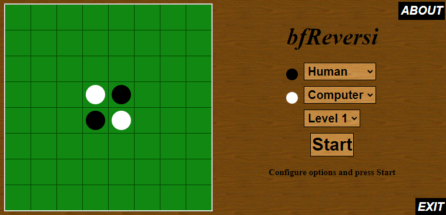

# bfReversi

bfReversi is an HTML/CSS/Javascript implementation of the [Reversi game](https://en.wikipedia.org/wiki/Reversi) (also known as Othello).

Have a look at the online playable version.

I wrote it to learn CSS and Javascript. The play algorithm is not very sophisticated as it only choses the next position to be played based on the maximum number of taken pieces added with a weight depending on the played position (the difficulty level is selectable but makes no difference).

The original Aptana project, containing the HTML Widget compatible with Symbian on the Nokia 5800, is available in the [zip file](bfReversi.zip).
